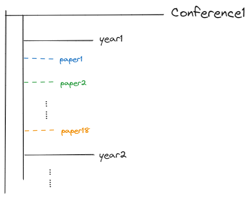

# Introduction

咳咳，首先呢……这是一份paper（更准确地说是papers）阅读笔记\~

网页版本的链接在这里：[paper notes](https://elsies-planet.gitbook.io/papernotes/)

同时在github也备份了，所谓狡兔三窟：[repo](https://github.com/Ghy0202/PaperNotes)

笔记一级目录按照不同的会议进行相应的整理，二级目录是年份，三级对应paper的具体的笔记，总体的设计架构为：

<figure><figcaption>
overview
</figcaption></figure>
